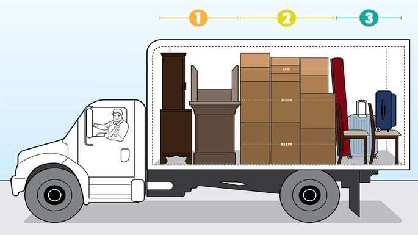
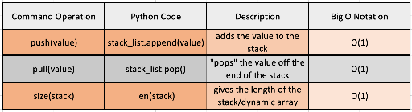

# **Stack**
## **Examples**

A stack is good for memory, or history. Situations that include keeping a history of what occurs can greatly benefit from using stacks.



Think of loading a Uhaul truck. Each box and piece of furniture has an order of how it got put in. When you start to unload the truck the last pieces come out first until you can reach the first box or furniture put into the truck.

You can also think of a browser's search history. Each address on the internet you go to gets added to the stack. When you look at the history it shows the most recently added internet search you've made and then continues showing you what was looked for previously. The first in the history is the last to be seen, just as the Uhaul trucks layout.

## **Big O Notation & Commands Within a Stack**
Overall, Big O Notation within a stack is O(1). Reason why is because it's referencing an array. Usually when using a stack the top is affected. 

The commands used for a stack are the push and pull commands. The push command is used to add data on the top of the stack and, in python, is ***.append(data)***. The pull command takes the top data reference from the stack and, in python, is ***.pop(data)***. You can also check the size of the stack through using the len(stack) function within python.

Within python a dynamic array is used, unlike other languages using just a regular array. The commands, and their Big O Notation, are as follows:



## **Coding Example**
```python
def making_a_stack():
    item = ""
    stack_list = []
    while item.upper() != "STOP":
        item = input('Type what you want in a bag, then type "stop" to stop: ')
        if item.upper() != "STOP":
            stack_list.append(item) 
            # the .append() command adds the variable onto the stack
    return stack_list

# Processing the stack after it's been made
def processing_a_stack(stack):
    for x in range(len(stack)): 
        # The len() command is used here to get the length for the for loop
        output = stack.pop() 
        # The .pop() command pops the last item off the stack
        print(output)

item_stack = making_a_stack()
processing_a_stack(item_stack)
```

## **Solveable Problem**
Here is a practice problem to try your knowledge. Try to avoid looking at the solution to see how well you can implement a stack!
- [Problem](PythonStuff/01_stackProblem.py)
- [Solution](PythonStuff/01_stackSolution.py)