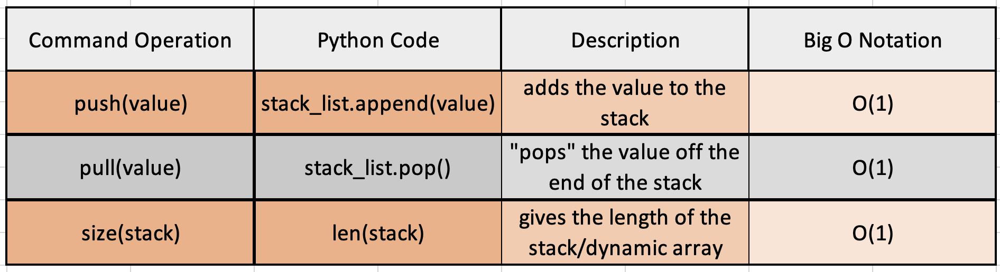

# Stack
## Examples


Think of loading a Uhaul truck. Each box and piece of furniture has an order of how it got put in. When you start to unload the truck the last pieces come out first until you can reach the first box or furniture put into the truck.

You can also think of a browser's search history. Each address on the internet you go to gets added to the stack. When you look at the history it shows the most recently added internet search you've made and then continues showing you what was looked for previously. The first in the history is the last to be seen, just as the Uhaul trucks layout.

## Big O Notation & Commands Within a Stack
A stack in python uses a dynamic array. The commands, and their Big O Notation, are as follows:


Big O Notation for a stack is O(1) because of each command used for making and using stacks is also O(1)

## Coding Example
```python
def making_a_stack():
    item = ""
    stack_list = []
    while item.upper() != "STOP":
        item = input('Type what you want in a bag, then type "stop" to stop: ')
        if item.upper() != "STOP":
            stack_list.append(item) 
            # the .append() command adds the variable onto the stack
    return stack_list

# Processing the stack after it's been made
def processing_a_stack(stack):
    for x in range(len(stack)): 
        # The len() command is used here to get the length for the for loop
        output = stack.pop() 
        # The .pop() command pops the last item off the stack
        print(output)

item_stack = making_a_stack()
processing_a_stack(item_stack)
```

## Solveable Problem
Here is a practice problem to try your knowledge. Try to avoid looking at the solution to see how well you can implement a stack!
- [problem](PythonStuff/stack_problem.py)
- [solution](PythonStuff/stack_solution.py)