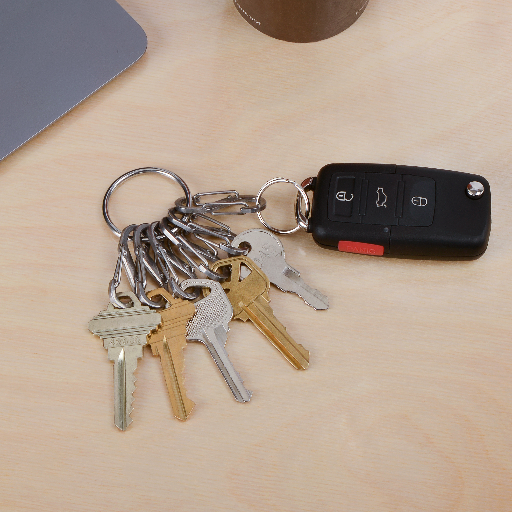
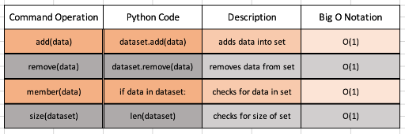

# **Set**

## **Examples**
When order within data isn't important, and duplicates are not needed to be counted, a set is very handy to use.



A set can be thought of as a keyring with keys on it. You have a key for your car, front door, safe, and anything else that would be needed. You don't need another key for your door, and you don't need to put all the keys in a specific order that everyone understands.

## **Big O Notation and Commands Within a Set**
Big O Notation within a set stays within O(1) for sets. This is partially due to there being no need of order within the set and having no duplicates through the hashing of each item. For example, any variable (like "cat") would hash out the exact same way as any previously variable (also named "cat"). If any item being put into the set is the exact same hash value, then it's not accepted into the set. 

The main commands for a set are the add and remove commands. The add command is **.add(data)** and will add that into the overall set. The remove command is **.remove(data)** and removes the specific data piece from the set that you no longer want within the set.

*Note: The remove command will throw out an error if the specified item your removing does not already exist within the set.*

The main commands (and extra commands to check for size and for a specific item within the set), as well as the Big O Notation, are as follows:



## **Coding Example**

```python
keys_in_box = ["house", "car", "church", "safe",
"truck", "shed", "fence gate", "safe", "car",
"car", "shed", "church", "shed", "car", "garage door", 
"storage", "crawl space", "car", "safe", "house", "shed",
"crawl space", "back door", "car", "church", "storage",
"truck", "car", "back door", "church", "house", "fence gate"
]
def church_key_duplicates():
    # counts the duplicates of church keys within the box of keys
    count = 0
    for x in range(len(keys_in_box)):
        if "church" in keys_in_box[x]:
            count += 1
    print("there are {} church key duplicates within the box of keys\n".format(count))

# A new keyring to put each type of key on
keyring = set(keys_in_box)

print("The keys on your keychain: \n{}".format(keyring))
print("There are {} keys in the box\n".format(len(keys_in_box)))

# test the size of the keyring set
print("There are {} different kinds of keys in the box\n".format(len(set(keys_in_box))))

print("\nThe ward clerk wants all the church keys back that you have, so let's remove it off the keyring\n")

# Time to remove the church key from the keyring set
church_key_duplicates()
keyring.remove("church")
print("Now, the keys on the keyring and within the box: \n{}".format(keyring))
```
## **Solveable Problem**
Here is a practice problem to try your knowledge. Try to avoid looking at the solution to see how well you can implement a set!

-[Problem](PythonStuff/02_setProblem.py)

-[Solution](PythonStuff/02_setSolution.py)