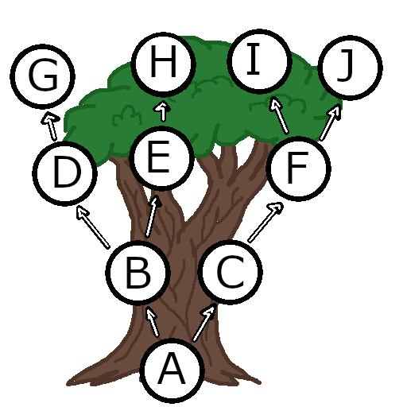

# **Tree**
###### [Back to Welcome](0-Welcome.md)

## **Examples**
Out of all three types of Data Structures, Trees are the most complicated.



Trees are a way to have organized nodes of data. This data can range from integers being sorted in the tree to a node holding a hash key from a library or anything else you want to organize. Think of it like a special linked list. Instead of the pointers connecting through one direct line there are a few branches because of the differing values between nodes.

You can think of a family tree for this. You have 2 parents who each also have 2 parents. You have 4 granparents but 2 of those are specifically from your dad and 2 from your mom. Each set of grandparents need to be organized so you can see who's more closely related to who.


## **Big O Notation and Commands Within a Tree**


## **Coding Example**
```python
class Tree:
    class Node:
        def __init__(self, data):
            # When the Node is created it makes sure the pointers to both left and right areas are empty.
            self.data = data
            self.left = None
            self.right = None
    def __init__(self):
        # When the Tree is first initialized it sets the root as empty so the first point of data will go into 
        self.root = None
    def insert(self, data):
        # if the root node is empty then the data gets set to that root node
        if self.root is None:
            self.root = Tree.Node(data)
        else:
            self._insert(data, self.root)
    def _insert(self, data, node):
        # if our data is smaller than the current node's data then we'll go to the left node
        if data < node.data:
            # if the current node is empty then we'll save the data here, if not we'll move again
            if node.left is None:
                node.left = Tree.Node(data)
            else:
                self._insert(data, node.left)
        # if our data is larger than the current node's data then we'll go to the right node
        else:
            if node.right is None:
                node.right = Tree.Node(data)
            else:
                self._insert(data, node.right)
    def __iter__(self):
        # the iteration function will now automatically reference the move_forward function just below 
        yield from self.move_forward(self.root)
    def move_forward(self, node):
        # the move_forward function uses recursion to ensure it will be referencing which node has what branch off's
        if node is not None:
            yield from self.move_forward(node.left)
            yield node.data
            yield from self.move_forward(node.right)
tree = Tree()
tree.insert(2)
tree.insert(1)
tree.insert(5)
tree.insert(9)
for x in tree:
    print(x)
    # will print out 1, 2, 5, 9
```

## **Solveable Problem**

-

-[Solution](PythonStuff/03_TreeSolution.py)